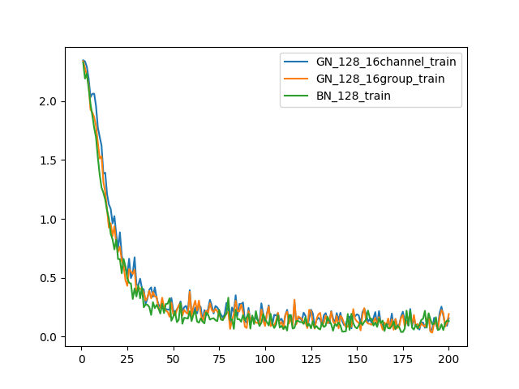
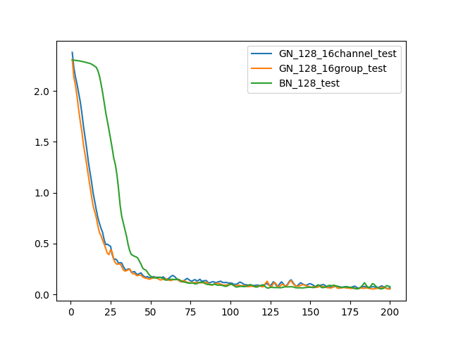
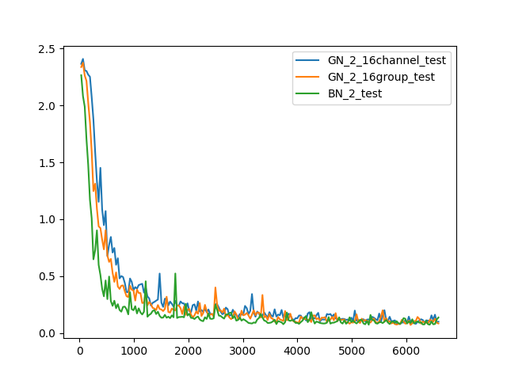

# Group_Normalization_pytorch
- Implementation of [**Group Normalization**](https://arxiv.org/abs/1803.08494).
- Do the Experiments on **MNIST**.

## Statement
- Class **GroupNorm1D(in_channels, G, channels_per_group, eps=1e-5)** for 1D features.
- Class **GroupNorm2D**, **GroupNorm3D** for 2D and 3D features.
- If you want to group normalization to process higher dimension features, you can Class **GroupNormND(ND, in_channels, G, channels_per_group, eps=1e-5)**. For example, **GroupNormND(4, ...) for 4D features.
- Parameter **G** means *group number*.
- Parameter **channels_per_group** means c*hannel number in each group*.
- Only can assign a **integer** to one parameter and assign **None** to another.
- You can find the the code of group normalization in **lib/group_normalization.py**.
- If there is something wrong in my code, please contact me, thanks!

## Environment
- python 3.6
- pytorch 0.4.0

## Visualization of Loss
- Train loss of batch size 128.

- Test loss of batch size 128.

- Test loss of batch size 2.

